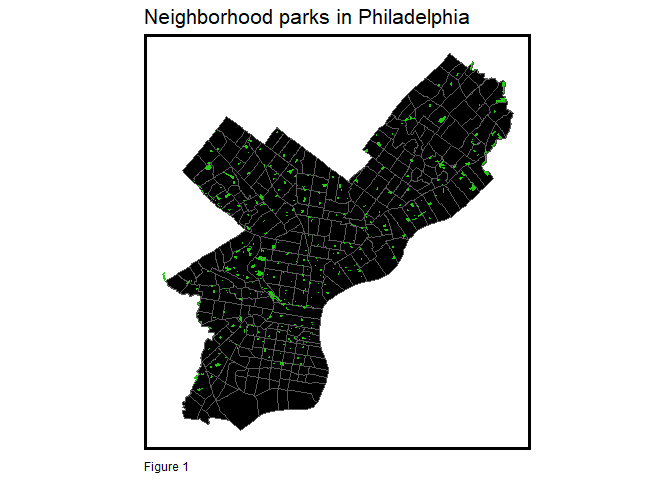
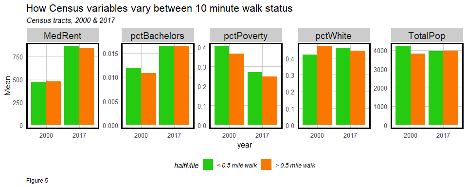

## 1. Motivation 

This exercise was inspired by Dr. Eugenia South and Diana Regas' April, 2021 [editorial](https://www.nbcnews.com/think/opinion/covid-s-park-resurgence-shows-how-biden-stimulus-money-can-ncna1265076) on park access equity in American cities. They write, in part:

|           "...According to data collected by The Trust for Public Land, more than 100 million Americans do not have a park 
|            within a 10-minute walk of home, and studies have shown that parks serving primarily people of color are half the 
|            size and serve five times more people than parks in predominantly white neighborhoods."
<br>         

Using (mostly) simple R code from my new book, [Public Policy Analytics: Code & Context for Data Science in Government](https://urbanspatial.github.io/PublicPolicyAnalytics/index.html) (CRC Press), this markdown serves as a beginner's framework for exploring the spatial pattern of park access equity for any community nationally (so long as they have open park data). Here, examples are given for Philadelphia. 

I hope you will 
replicate this analysis in your community and share your results online with the hashtag #parkEquity. 

## 2. Load libraries and download data

All of the below code below is pulled from my new book, including a script with some simple functions. A color palette is set and the requisite libraries are loaded.


```r
root.dir = "https://raw.githubusercontent.com/urbanSpatial/Public-Policy-Analytics-Landing/master/DATA/"
source("https://raw.githubusercontent.com/urbanSpatial/Public-Policy-Analytics-Landing/master/functions.r")

palette5 <- c("#25CB10","#5AB60C","#8FA108","#C48C04","#FA7800")

library(sf)
library(tidyverse)
library(tidycensus)
library(spdep)
library(FNN)
library(gridExtra)
```

Next, the Philadelphia city boundary and parks are downloaded from [OpenDataPhilly](https://www.opendataphilly.org/). The analysis will only focus on what the City calls "Neighborhoood Parks" (`parks2`), which tend to be smaller, as Figure 1 illustrates. 


```r
bound <-
  st_read("https://opendata.arcgis.com/datasets/063f5f85ef17468ebfebc1d2498b7daf_0.geojson")

parks <- 
  st_read("https://opendata.arcgis.com/datasets/d52445160ab14380a673e5849203eb64_0.geojson")

parks2 <- 
  filter(parks, PROPERTY_CLASSIFICATION == "NEIGHBORHOOD_PARK") %>%
  st_transform('ESRI:102728') 

ggplot() + 
  geom_sf(data=bound, fill="black") +
  geom_sf(data=parks2, fill="#25CB10", colour=NA) +
  labs(title="Neighborhood parks in Philadelphia",
       caption = "Figure 1") +
  mapTheme()
```



## 3. Are parks equally distributed throughout the City?

Figure 1 suggests that parks are equally distributed throughout Philadelphia. The code below calculates the average distance from each park to its 2 nearest parks and plots a distance histogram with the mean (797ft) and standard deviation (494ft) distances shown as vertical lines. 


```r
nearestPark <- 
  parks2 %>%
    mutate(
      distTo2NearestParks = 
        nn_function(st_coordinates(st_centroid(parks2)), st_coordinates(st_centroid(parks2)), 2),
      Mean = mean(distTo2NearestParks),
      Standard_Dev = sd(distTo2NearestParks)) %>%
  st_drop_geometry() %>%
  dplyr::select(distTo2NearestParks, Mean, Standard_Dev) %>%
  gather(Variable, Value, -Mean, -Standard_Dev)

ggplot(data=nearestPark, aes(Value)) + 
  geom_histogram(fill= "black") +
  geom_vline(aes(xintercept = Mean), colour = "#25CB10", size=2) +
  geom_vline(aes(xintercept = Standard_Dev), colour = "#FA7800", size=2) +
  xlim(0, 5280) + plotTheme() +
  labs(title="Histogram of distances from each park to its 2 nearest neighbors",
       subtitle = "Mean (in green) = 797ft; Standard deviation (in orange) = 494ft", 
       caption = "Figure 2")
```


It seems like park access is relatively consistent throughout the City, but the real question is about _equitable access_, and for that, we need to read in some Census data.

## 4. Read in Census data and spatially relate to parks

The `tidycensus` package is used to read in Philadelphia Census tract data for 2000 and 2017 (You will need a [Census API Key](https://api.census.gov/data/key_signup.html)). The 2000 data below is pre-downloaded from the book, but the 2017 data comes from the Census API. You can adjust this code to download tract data for your community. Note these data come with tract geometries (not pictured).


Here is a look at the first six rows of the 2000 data. Note the demographic features collected.


```
##   MedRent TotalPop MedHHInc  pctWhite pctBachelors pctPoverty year
## 1     858     2576    48886 0.8132764  0.043478261  0.6750776 2000
## 2     339     1355     8349 0.1298893  0.070848708  0.3726937 2000
## 3     660     2577    40625 0.7345751  0.055878929  0.4613892 2000
## 4     601     4387    27400 0.7611124  0.028949168  0.6856622 2000
## 5     501     1071     9620 0.3968254  0.006535948  0.2978525 2000
## 6     913     1384    41563 0.7037572  0.067919075  0.4017341 2000
```

Next, 2017 Census tract data is downloaded with the same variables as 2000.


 

```
##   TotalPop MedHHInc MedRent  pctWhite pctBachelors pctPoverty year
## 1     2479    30746    1051 0.2815651   0.10407422 0.38805970 2017
## 2     1375    42135    1363 0.7970909   0.08436364 0.38981818 2017
## 3     1949    42548    1095 0.7449974   0.06926629 0.24268856 2017
## 4     3259   109020    1598 0.9377110   0.01258055 0.06474379 2017
## 5     2154    41335     841 0.2479109   0.02089136 0.16945218 2017
## 6     6583    38301     774 0.6983138   0.02491265 0.21616284 2017
```

Now that we have our Census tract data, it is time to relate it to the parks by measuring the distance from each tract to its _k_ nearest parks. Serious scale issues arise when measuring distance between polygons. The easiest but least accurate solution is to measure from a tract centroid (its gravitational center) to a park centroid. 

Our approach will be to measure to the park _boundary_ by cleverly converting park boundaries to points (we could do this in `raster` too, but with more effort). `st_cast` is used to convert park boundary lines to points and the result is mapped.


```r
parks_as_points <- 
  parks2 %>%
  st_cast(., "POINT")
```


Next, the average nearest neighbor distance (_k_ = 5) is measured from both 2000 and 2017 Census tract centroids to park boundary points. Additionally, we denote if that distance is greater than or less than a `halfMile` - roughly a ten minute walk.


```r
tracts00 <-
  tracts00 %>%
  mutate(
    distToParks = 
      nn_function(st_coordinates(st_centroid(tracts00)), st_coordinates(parks_as_points), 5),
      halfMile = ifelse(distToParks > 880, "> 0.5 mile walk", "< 0.5 mile walk"),
      halfMile = as.factor(halfMile)
    ) 
 
tracts17 <-
  tracts17 %>%
    mutate(
      distToParks = 
        nn_function(st_coordinates(st_centroid(tracts17)), st_coordinates(parks_as_points), 5),
        halfMile = ifelse(distToParks > 880, "> 0.5 mile walk", "< 0.5 mile walk"),
        halfMile = as.factor(halfMile))  
```


```
## Simple feature collection with 6 features and 2 fields
## geometry type:  MULTIPOLYGON
## dimension:      XY
## bbox:           xmin: 2688965 ymin: -68894.43 xmax: 2700290 ymax: -64443.03
## projected CRS:  NAD_1983_StatePlane_Pennsylvania_North_FIPS_3701_Feet
##   distToParks        halfMile                       geometry
## 1  1312.47525 > 0.5 mile walk MULTIPOLYGON (((2697812 -65...
## 2   604.40457 < 0.5 mile walk MULTIPOLYGON (((2696038 -65...
## 3    59.93081 < 0.5 mile walk MULTIPOLYGON (((2690929 -64...
## 4  1151.59618 > 0.5 mile walk MULTIPOLYGON (((2693009 -66...
## 5  1908.42798 > 0.5 mile walk MULTIPOLYGON (((2697206 -67...
## 6  1408.61985 > 0.5 mile walk MULTIPOLYGON (((2696968 -68...
```

Finally, 2000 and 2017 tracts are bound together as `allTracts`.


```r
allTracts <- 
  rbind(dplyr::select(tracts00, distToParks, halfMile, MedRent, TotalPop, 
                      pctWhite, pctBachelors, pctPoverty, year), 
        dplyr::select(tracts17,distToParks, halfMile, MedRent, TotalPop, 
                      pctWhite, pctBachelors, pctPoverty, year))
```

## 5. Are 10 minute walk times equally distributed throughout City?

Figure 4 maps the `halfMile` indicator to illustrate for 2000 and 2017, where the shorter walks are throughout Philadelphia. Interestingly, these patterns seems to be systematic.


```r
ggplot() + 
  geom_sf(data=allTracts, aes(fill = halfMile)) +
  geom_sf(data=parks2, colour=NA, fill="black") +
  facet_wrap(~year) +
  scale_fill_manual(values = palette5[c(1,5)],
                    name="Walk Distance") +
  labs(title = "Census tracts within 10 minute walk (half mile) to nearest park,
       \nPhiladelphia",
       subtitle = "Parks overlayed; Distance measured from tract centroid to nearest park 
       boundary",
       caption = "Figure 4") +
  mapTheme()
```


Are shorter walks clustered near shorter walks in 2017? Are farther walks clustered near farther walks? In other words, is park access clustered? Below we test the spatial autocorrelation (clustering) of these outcomes using a Join Count test. This is a null hypothesis test that asks whether the `halfMile` labels are more clustered than we might expect due to random chance alone. 

To do so, `tracts17` is converted to centroids and xy coordinates. A nearest neighbor spatial weights matrix is created and the Join Count test is run.

Given the p-values, there is evidence, at least in 2017, to suggest that both low and high access seem to cluster near each other. This however, still doesn't tell us whether this systematic clustering falls along demographic differences. Let's explore that next.


```r
coords17 <-  
  tracts17 %>%
  st_centroid() %>% 
  st_coordinates() 

neighborList17 <- knn2nb(knearneigh(coords17, 5))
spatialWeights17 <- nb2listw(neighborList17, style="B")
joincount.test(filter(
  allTracts, year == 2017)$halfMile, 
  spatialWeights17)
```

```
## 
## 	Join count test under nonfree sampling
## 
## data:  filter(allTracts, year == 2017)$halfMile 
## weights: spatialWeights17 
## 
## Std. deviate for < 0.5 mile walk = 2.2444, p-value = 0.0124
## alternative hypothesis: greater
## sample estimates:
## Same colour statistic           Expectation              Variance 
##             192.00000             174.49086              60.86204 
## 
## 
## 	Join count test under nonfree sampling
## 
## data:  filter(allTracts, year == 2017)$halfMile 
## weights: spatialWeights17 
## 
## Std. deviate for > 0.5 mile walk = 1.5755, p-value = 0.05757
## alternative hypothesis: greater
## sample estimates:
## Same colour statistic           Expectation              Variance 
##              327.5000              314.4909               68.1806
```

## 6. Do measures of race and income vary by 10 minute walk status?

The bar plots below explore this question by comparing the means of various demographic factors across the `halfMile` designation in both Census years. If those means vary significantly between greater than and less than a half mile walk, it may indicate a lack of equity in park access. 

The bar plots below do not reveal much evidence to suggest this is true, however. It is clear that between 2000 and 2017, rents and bachelors degrees increased while poverty decreased.


```r
allTracts %>%
  st_drop_geometry() %>%
  dplyr::select(-distToParks) %>%
  gather(Variable, Value, -year, -halfMile) %>%
  ggplot(aes(year, Value, fill = halfMile)) + 
    geom_bar(position = "dodge", stat = "summary", fun = "mean") + 
    facet_wrap(~Variable, scales = "free", ncol=5) +
    scale_fill_manual(values = palette5[c(1,5)]) +
    labs(title = "How Census variables vary between 10 minute walk status",
         subtitle = "Census tracts, 2000 & 2017", y = "Mean",
         caption = "Figure 5") +
    plotTheme() + theme(legend.position="bottom")
```



## 7. Are there equity issues in park quality?

This section is the crux of the analysis. It may be the case that parks are equally distributed throughout the City, but is park quality? There are many ways to define park quality, and ideally, we'd like qualitative measures of park assets, like playgrounds, or quantitative measures, like greenness or land surface temperature. 

As these data are not readily available, we ask whether park size varies across both a `raceContext` and an `incomeContext` - both generated from Census data. 

The code block below measures the acreage of each neighborhood park Citywide.


```r
parks2 <- 
  parks2 %>%
  mutate(Area = st_area(.),
         Acres = as.numeric(Area) * 2.29568e-5 ) 
```

Next, in order to relate tracts to their local parks, a spatial join is performed. As some parks straddle tracts, `parks2` centroids are used in the join below. Those 2017 tracts that have no overlaying park centroid are discarded from this part of the analysis.


```r
parksJoinTracts <- 
  st_join(tracts17, 
          dplyr::select(parks2, Acres) %>%
          st_centroid())
```

Next, `raceContext` and `incomeContext` indicators are created from the Census tract data assuming any tract with a percent white population of less than 0.5 is "Majority Non-White", otherwise, it is "Majority White". 

Any tract that falls below the mean 2017 Median Household Income figure (`mean(tracts17$MedHHInc, na.rm=T)`) is classified as "Low Income", otherwise, it is "High Income". A bit of factor reordering helps make the below data viz more consistent.


```r
parksJoinTracts <- 
  parksJoinTracts %>%
    mutate(Race_Context = ifelse(pctWhite < .5, "Majority Non-White", "Majority White"),
           Income_Context = ifelse(MedHHInc < 44432, "Low Income", "High Income")) 

parksJoinTracts$Income_Context <- 
  factor(parksJoinTracts$Income_Context, levels = c("Low Income", "High Income"))
```

Both the `raceContext` and `incomeContext` are mapped below. Race and class do not diverge much in Philadelphia, and the segregation is evident.


```r
grid.arrange(ncol = 2,
  ggplot() + geom_sf(data = parksJoinTracts, aes(fill = Race_Context)) +
    scale_fill_manual(values = c("#25CB10", "#FA7800"), name="Race Context") +
    labs(title = "Race Context", caption = "Figure 6") +
    mapTheme() + theme(legend.position="bottom"), 
  ggplot() + geom_sf(data = parksJoinTracts, aes(fill = Income_Context)) +
    scale_fill_manual(values = c("#25CB10", "#FA7800"), name="Income Context") +
    labs(title = "Income Context", caption = " ") +
    mapTheme() + theme(legend.position="bottom"))
```


With `Acres`, `raceContext` and `incomeContext` in hand, the bar plots below visualize the mean neighborhood park acreage by race and income designation. Some significant differences emerge - namely that on average, park size in poorer, non-white tracts is two acres less than in tracts with more white, affluent populations.

This is where I think more nuanced datasets can be brought in to test qualitative differences in park quality. 


```r
grid.arrange(ncol=2,
  st_drop_geometry(parksJoinTracts) %>% 
    dplyr::select(Acres, Race_Context) %>%
    filter(!is.na(Acres)) %>% #get rid of those tracts without parks
    gather(Variable, Acres, -Race_Context) %>%
      ggplot(aes(Race_Context, Acres, fill=Race_Context)) + 
      geom_bar(position = "dodge", stat = "summary", fun = "mean") +
      scale_fill_manual(values = c("#25CB10", "#FA7800"), name="") +
      labs(title="Mean park area by race context",
           subtitle="Acres", caption = "Figure 7") +
      plotTheme() + theme(legend.position = "none"),
  st_drop_geometry(parksJoinTracts) %>% 
    dplyr::select(Acres, Income_Context) %>%
    filter(!is.na(Income_Context)) %>% #get rid of those tracts without parks
    gather(Variable, Acres, -Income_Context) %>%
    ggplot(aes(Income_Context, Acres, fill=Income_Context)) + 
    geom_bar(position = "dodge", stat = "summary", fun = "mean") +
    scale_fill_manual(values = c("#25CB10", "#FA7800"), name="") +
    labs(title="Mean park area by income context", subtitle="", caption = " ") +
    plotTheme() + theme(legend.position = "none"))
```


## 8. Conclusion

Dr. South and Ms. Regas' editorial asks whether parks and park quality are equitably distributed in American cities. My goal here was to provide an open source framework spatial analysts could use to address this question in any community nationally. 

95% of the code used in this analysis can be found in my new book, [Public Policy Analytics](https://urbanspatial.github.io/PublicPolicyAnalytics/index.html). Again, I hope folks from around the country will replicate this work in their own community. 
